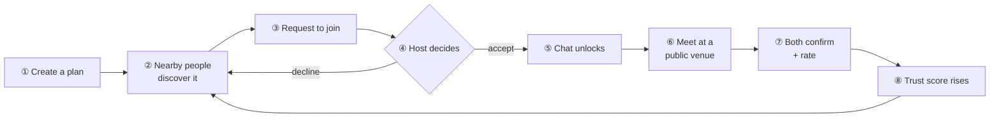
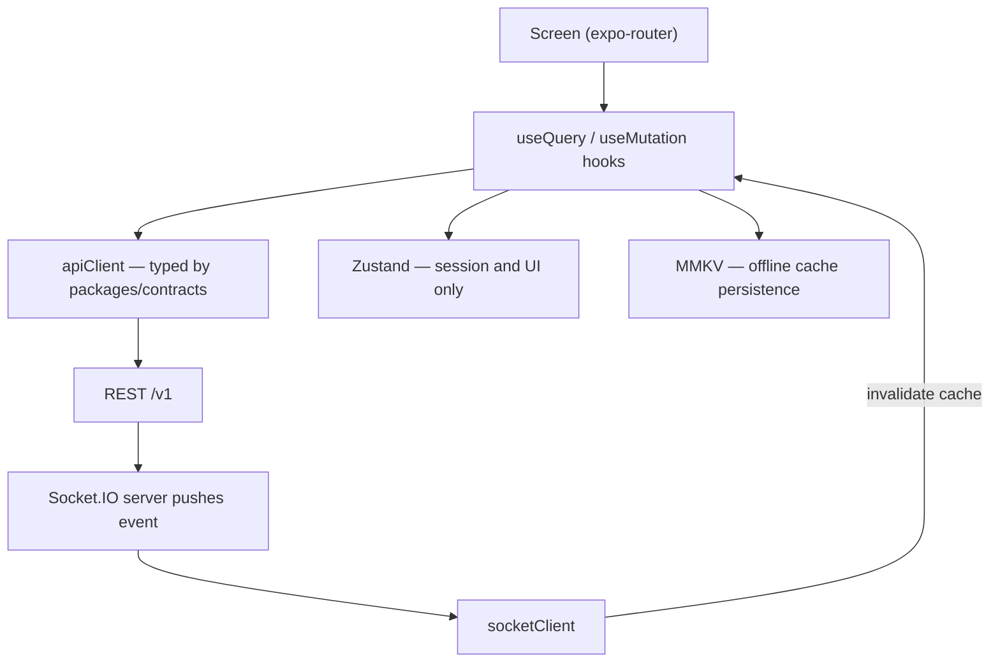
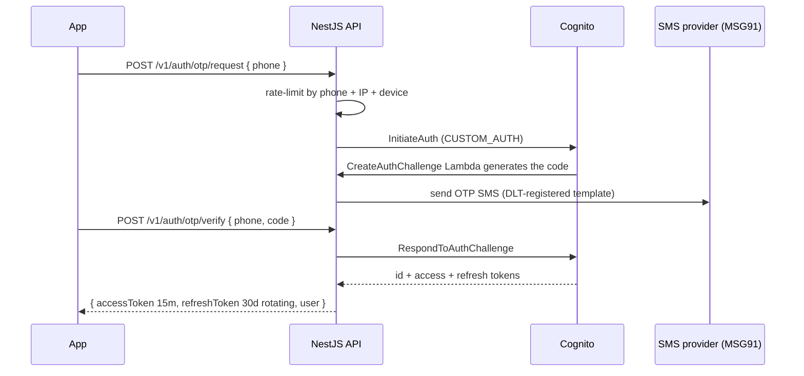
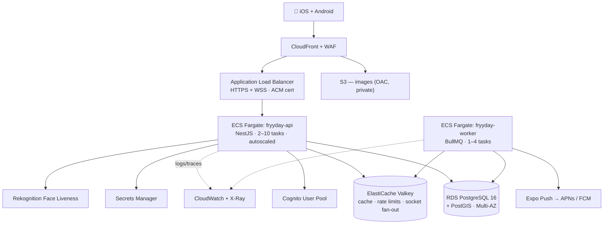

# FRYYDAY — Production PRD & Engineering Specification

**Version 2.0 · Status: ACTIVE · Date: 2026-09-07 · Owner: Aiverse (Founder/CTO)**
**Supersedes:** every document in `_archive/`. Where anything disagrees with this file, **this file wins.**

| | |
|---|---|
| **Product** | Fryyday — turns nearby verified people into real in-person plans |
| **Client** | **React Native (Expo SDK 54, New Architecture)** — one codebase, iOS + Android |
| **Backend** | **NestJS 11 (TypeScript) on AWS ECS Fargate** |
| **Data** | **Amazon RDS PostgreSQL 16 + PostGIS 3.4**, ElastiCache Valkey |
| **Target** | Production launch, single city (Bangalore), 50k registered / 5k DAU |
| **Non-goal** | Anything that does not move a user one step around the core loop (§2.2) |

---

## 0. How to read this document

This PRD is written in **six voices**, because the ask was for six kinds of guidance. Each section is
tagged so you know whose call it is and who to argue with:

| Tag | Voice | Owns |
|---|---|---|
| 🧭 **PM** | Senior Product Manager | Problem, scope, priority, metrics, what does *not* get built |
| 🎨 **UX** | Senior UI/UX Designer | Design system, screens, states, accessibility, motion |
| 📱 **MOB** | Senior React Native Engineer | App architecture, navigation, state, native modules, release |
| ⚙️ **BE** | Senior Backend / Full-Stack Engineer | API, domain logic, database, realtime, jobs |
| ☁️ **INF** | Senior DevOps / Cloud Architect | AWS topology, IaC, CI/CD, cost, observability |
| 🔍 **QA** | Senior QA / Release Manager | Test strategy, gates, definition of done |

**Reading order if you are short on time:** §1 → §2 → §4 (scope) → §16 (delivery plan) → §17 (what I need from you).

---

## 1. Executive summary

### 1.1 What we are building

Fryyday is a **safety-first, activity-first social app** that solves a specific failure: adults have
contacts but no plans. Dating apps optimise for matching. Messaging apps optimise for talking.
**Fryyday optimises for actually showing up somewhere.**

A user opens the app, sees real plans happening near them this week — a 7am walk, coffee at 4,
pickleball on Sunday — asks to join one, the host accepts, a chat opens, they meet in a public place,
and both confirm it happened. That last confirmation is the only metric that matters.

### 1.2 What changes in v2.0 🧭 PM

v1 was a **single-device Flutter demo**: beautiful, 117 tests green, an installable APK — and
fundamentally a simulation. There was no server. The "other person" was a `Timer`. Closing the app
lost everything.

v2.0 makes it **real**, and switches the client stack to React Native as directed.

| | v1 (Flutter demo — archived) | **v2.0 (this document)** |
|---|---|---|
| Client | Flutter / Dart | **React Native + Expo, TypeScript** |
| Other users | Simulated with timers | **Real people over the network** |
| Persistence | In-memory (lost on close) | **Postgres, durable, backed up** |
| Auth | Any 6 digits pass | **Real SMS OTP via Cognito** |
| Realtime | Fake | **Socket.IO over WebSocket, Redis fan-out** |
| Location | Seeded coordinates | **Real GPS, PostGIS radius queries** |
| Map | Stylised pins, no tiles | **react-native-maps, dark-styled** |
| Hosting | None | **AWS: ECS Fargate, RDS, ElastiCache, S3/CloudFront** |
| Distribution | Sideloaded APK | **App Store + Google Play via EAS** |

### 1.3 The honest cost of the stack switch 🧭 PM

You asked for React Native only, so React Native it is — but you should make that call with the price
in front of you, because it is not zero:

- **~9,000 lines of working Dart** (86 files, 117 passing tests, a full design system, 22 screens,
  a built-and-tested invitation/ranking/trust engine) do not port automatically. They are now in
  `legacy-flutter/`.
- **Roughly 3 of the 14 weeks below is re-implementing UI that already existed.**

**What we keep and what we rebuild:**

| Asset | Fate |
|---|---|
| Product design, core loop, safety invariants | ✅ **Kept verbatim** — hard-won, correct |
| "Striking Lightning" design system + all tokens | ✅ **Kept**, re-expressed as a TS theme (§5) |
| Ranking / trust / credit / gate algorithms | ✅ **Ported Dart → TypeScript**, moved *server-side* (§9) |
| Screen inventory + interaction specs | ✅ **Kept** as the build checklist (§6) |
| Flutter widget implementations | ❌ Rebuilt in RN |
| LAN peer-to-peer mesh (`lib/net/`) | ❌ **Deleted.** Superseded by a real server — it existed only to fake multiplayer without hosting |

**Why React Native is nonetheless a defensible choice here:** one language (TypeScript) from the
Postgres query to the button label, a shared `packages/contracts` that makes client/server type
drift *impossible*, over-the-air updates for instant hotfixes without app-store review, and a far
larger hiring pool in India. That shared-types property is the single biggest lever on your
"**no errors**" requirement, and Flutter cannot offer it.

### 1.4 The three requirements you repeated, made concrete

You said three things over and over. Here is exactly how each is delivered, so they are testable
rather than aspirational:

| You said | What it means in this document |
|---|---|
| **"no error"** | §11 — a **7-layer error-elimination strategy**: TypeScript strict, one Zod schema per API shape shared by client *and* server, runtime validation at every boundary, DB constraints as the final backstop, blocking CI gates, error boundaries + typed error envelope, Sentry on both tiers. Plus a **Definition of Done** no PR merges without. |
| **"deploy in AWS faster"** | §13 — the entire cloud is **one `cdk deploy`**. Infrastructure is code, reviewed in PRs, reproducible across three environments. First deploy ≈ 25 minutes; every deploy after that ≈ 6 minutes, zero-downtime, with automatic rollback on failed health checks. |
| **"designed beautifully / correctly"** | §5–§6 — the design system is **tokens in code**, not a PDF. Every screen has acceptance criteria, every state (loading / empty / error / offline) is specified, and accessibility is a merge gate, not a phase-9 cleanup. |

---

## 2. The product 🧭 PM

### 2.1 Problem, user, promise

**Problem.** Between 22 and 35, the social defaults break. College ends, people move cities, work goes
remote. You still have a contact list — you just have nothing on the calendar. Existing products make
this *worse*: they hand you infinite strangers to talk to and no reason to leave the house, and the
moment you try to meet someone the experience feels unsafe or spammy.

**User (v1.0, deliberately narrow).** 22–35, living in **Bangalore**, new to the city / newly remote /
recently out of college. Has disposable time on weekday evenings and weekends. Owns a smartphone,
uses UPI, is used to verification friction.

**Promise.** *"Something real to show up to this week, with people you can trust."*

**Explicit non-goals for v1.0.** These are not "later" — they are **refusals**, and every one exists to
protect the loop:

| Non-goal | Why |
|---|---|
| Dating / romance framing | Changes user intent, changes safety profile, changes who joins. Fryyday is activity-first and group-capable |
| Infinite feed + DMs with strangers | This is the thing we are the alternative to |
| Nationwide / multi-city launch | Liquidity is local. A thin map in 12 cities is worse than a dense one in 1 |
| Paid subscriptions | Credits are an anti-spam budget, **not** a paywall. Monetising reach corrupts the safety mechanic |
| Sophisticated ML ranking | You cannot fit a model on data you do not have. Deterministic sort until the data exists (§9.4) |
| Web app | Mobile-only. The product is "leave the house" |

### 2.2 The core loop — the spine of the entire product



**The rule that governs scope:** a feature that does not move a user one step further around this
loop does not ship in v1.0. Print this. Use it to say no.

### 2.3 The five safety invariants — enforced in code, not in copy ⚙️ BE

These *are* the product. In v1 three of the four were enforced only on the client, which means they
were decorative — a patched client could bypass every one. **In v2.0 all five are enforced
server-side, and each has a named test that fails the build if broken.**

| # | Invariant | Server enforcement | Test |
|---|---|---|---|
| **I1** | **Accept-before-chat.** Nobody can message you until *you* accepted them. Requesting is never enough. | `ChatGuard` verifies an accepted row in `plan_members` before any `message.send` is accepted on the socket **or** REST. Rejection is silent to the sender | `i1-accept-before-chat.e2e.ts` |
| **I2** | **Verified-first.** Identity verification gates hosting and 1:1 Find. Trust is visible on every profile | `@RequiresVerification()` guard on `POST /plans` and `POST /finds` | `i2-verification-gate.e2e.ts` |
| **I3** | **Public venues by default.** Plans meet in public; the venue carries a `public` badge | `venue_public` defaults `true`; private venues require an explicit confirm and are excluded from Discover | `i3-public-venue.e2e.ts` |
| **I4** | **Consent is revocable and cheap.** Block, report, quiet hours and women-only plans are one tap and always reachable | Blocks are bidirectional and filtered at the **SQL** layer of every listing query, not in the app | `i4-block-is-bidirectional.e2e.ts` |
| **I5** | **🆕 No silent location leakage.** Exact coordinates never leave the server for another user | The API returns a **jittered, bucketed distance band** (`"1–2 km"`), never another person's raw lat/lng. Enforced by a serialiser that has no field for it | `i5-no-raw-coords.e2e.ts` |

> **I5 is new in v2.0 and non-negotiable.** The moment there is a real network, "show me who is
> nearby" becomes "let me triangulate where she lives". A response DTO that *cannot represent* another
> user's exact position is the only defence that survives a hostile client.

### 2.4 The two connection paths

Fryyday has exactly two ways two people end up together. They must never be conflated.

**Path A — the Plan path** *(scheduled · group · public)*
> Someone hosts an activity at a time and place; others ask to join.

`Create Plan` → surfaced in `Feed` / `Map` → `Plan Detail` → **Request to join** → host accepts →
**plan chat unlocks** → meet → `My Plans → Past` → confirm attendance + rate.

**Path B — the Find path** *(spontaneous · 1:1 · expires in 24h)*
> You are out right now; so is someone nearby. Connect for 24 hours or not at all.

`Discover` (radar of nearby people) → **Find** a person → they accept → **a 24-hour group is created**
with a live countdown → chat inside it → **it expires and disappears**.

The Find path exists because the Plan path is too slow for *"I'm free now"*. The 24-hour expiry is the
safety mechanism, not a limitation: a spontaneous connection must not silently become a permanent
channel. Expiry is executed **server-side by a scheduled job** (§8.6), never by the client.

### 2.5 Personas

| Persona | Jobs-to-be-done | What breaks them |
|---|---|---|
| **Aditi, 26** — moved for work 3 months ago, knows nobody | "Give me one thing this weekend that isn't my flat" | Feels unsafe → needs I2, I4, I5 and women-only plans before she'll show |
| **Rohan, 31** — remote dev, hosts easily, wants a regular squad | "Let me create a thing and have people actually come" | Empty requests inbox → needs liquidity (M6), not better ranking |
| **Meera, 23** — final-year student, spontaneous, always out | "Who's near me *right now*?" | The Plan path is too slow → the Find path exists for her |

---

## 3. Success metrics 🧭 PM

**The one number that matters:** *confirmed meetups per active user per month.* Everything else is a
proxy, and the safety invariants outrank all of them.

| Metric | v1.0 target | Lever |
|---|---|---|
| **Invite → join conversion** *(North Star)* | ≥ 20% | Deterministic sort now; learned ranking only at T3 (§9.4) |
| **Weekly confirmed meetups** (both sides confirm) | grow WoW | **Liquidity** (M6), not the algorithm |
| Plan fill rate | ≥ 60% of plans reach ≥ 2 members | Discovery quality + reminders |
| Time-to-first-joinable-plan (new user) | < 60s from install | Onboarding + seeded hosts |
| Female participation | ≥ 35% | Women-only join rule + real verification |
| **Safety incident rate** | **→ 0** | I1–I5, verification, moderation queue |
| Invite fatigue (decline + mute rate) | < 15% | Caps, cooldowns, quiet hours |
| D7 / D30 retention | ≥ 25% / ≥ 12% | "Always something to join" |
| Crash-free sessions | **≥ 99.5%** | §11 |
| API p99 latency | **< 400 ms** | §12 |

---

## 4. Scope — v1.0 production release 🧭 PM

### 4.1 P0 — must ship. Not negotiable.

| # | Capability | Notes |
|---|---|---|
| P0-1 | Real phone auth (SMS OTP) + session management | §8.2 |
| P0-2 | Profile: photo upload, name, age, bio, interests, gender | S3 presigned upload |
| P0-3 | **Real identity verification** | Selfie liveness. Gates hosting (I2) |
| P0-4 | Create / edit / cancel a plan | Activity, venue, time, size, join rule |
| P0-5 | Discovery: Feed (soonest / nearest) + Map + filters | PostGIS `ST_DWithin` |
| P0-6 | Request to join → host accept/decline → membership | The loop |
| P0-7 | **Realtime group chat**, gated by I1 | Socket.IO |
| P0-8 | Attendance confirmation + mutual rating | Closes the loop |
| P0-9 | Trust score visible on every profile | §9.5 |
| P0-10 | Safety: block, report, quiet hours, women-only, SOS | I4 |
| P0-11 | Invite credits + ledger + daily grant | Server-authoritative (§9.6) |
| P0-12 | Push notifications (throttled, quiet-hours aware) | §8.7 |
| P0-13 | Find path: Discover → Find → 24h group → auto-expiry | Path B |
| P0-14 | Account deletion + data export | **Legal requirement**, India DPDP Act (§10.4) |

### 4.2 P1 — fast-follow (weeks 2–6 post-launch)

Waitlist for full plans · recurring plans ("every Tuesday") · plan templates · in-app moderation
console · referral invites · read receipts + typing indicators · richer profile (photo carousel) ·
calendar export · Hindi localisation.

### 4.3 P2 — later, on evidence only

Learned ranking (T3) · venue/business accounts · paid credit packs · multi-city · events ticketing ·
web companion · groups that persist past 24h.

### 4.4 Explicitly out of scope for v1.0

Video calling · in-app payments/splitting · stories/feed posts · public profiles/SEO · friend graph
import · Apple/Google social login *(phone is the identity; a second identity path weakens I2)*.

---

## 5. Design system — "Striking Lightning" 🎨 UX

The aesthetic survives the stack change unchanged. It is **dark glassmorphism × high-contrast
cyberpunk**: a total-black canvas, one electric neon accent used with discipline, frosted glass
surfaces, and **glow instead of drop shadows**.

> **The single rule that keeps it beautiful:** neon `#EAFF00` is a **scarce resource**. It marks the
> one thing on screen you should touch next. Two neon CTAs on one screen is a bug.

### 5.1 Tokens — `packages/ui/theme.ts` is the only source of truth 📱 MOB

No component may declare a raw hex value. An ESLint rule blocks it at review time.

```ts
export const colors = {
  background:       '#000000',  // app canvas — true black, not near-black
  surface:          '#0A0A0B',  // base surface
  surfaceBright:    '#121214',  // raised solid surface
  primary:          '#EAFF00',  // NEON — CTAs, active state, focus. Use sparingly
  onPrimary:        '#000000',  // text/icon on neon
  onSurface:        '#E3E2E7',  // primary text
  onSurfaceVariant: '#C7C9AB',  // secondary text
  outline:          '#919378',  // borders, mono labels
  success:          '#00C853',  // confirmed / verified
  error:            '#FF1744',  // decline / report / destructive
  warning:          '#FFAB00',  // expiring / caution
  glassFill:        ['rgba(255,255,255,0.03)', 'rgba(255,255,255,0.01)'], // 135° gradient
  glassBorder:      'rgba(234,255,0,0.15)',  // → 0.60 when active
} as const;

export const space  = { xs: 4, sm: 12, md: 24, lg: 48, xl: 80, gutter: 24 } as const;
export const radius = { tag: 4, button: 8, card: 16, sheet: 20, pill: 999 } as const;

export const type = {
  displayLg: { family: 'HankenGrotesk-ExtraBold', size: 56, weight: '800', tracking: -1.1, lh: 60 },
  headlineLg:{ family: 'HankenGrotesk-Bold',      size: 32, weight: '700', tracking: -0.4, lh: 38 },
  titleMd:   { family: 'HankenGrotesk-SemiBold',  size: 20, weight: '600', tracking: 0,    lh: 26 },
  bodyLg:    { family: 'HankenGrotesk-Regular',   size: 16, weight: '400', tracking: 0,    lh: 26 },
  bodySm:    { family: 'HankenGrotesk-Regular',   size: 14, weight: '400', tracking: 0,    lh: 20 },
  labelMd:   { family: 'JetBrainsMono-Medium',    size: 12, weight: '500', tracking: 1.2,  lh: 16 }, // UPPERCASE
} as const;

export const motion = {
  instant: 120, quick: 180, base: 240, slow: 400, reveal: 600,
  easing: { standard: [0.2, 0, 0, 1], decel: [0, 0, 0, 1], accel: [0.3, 0, 1, 1] },
} as const;
```

**Fonts are bundled, not fetched.** Hanken Grotesk + JetBrains Mono ship in the binary via
`expo-font`. A social app that shows a system-font flash on cold start looks broken, and the v1
`google_fonts` network fetch is not acceptable in production.

### 5.2 Elevation — glow, never drop shadow 🎨 UX

| Level | Treatment |
|---|---|
| **L0** | Solid `#000` — the canvas |
| **L1** | Glass: 135° `glassFill` gradient + `blur(20)` + 1px `glassBorder` |
| **L2 (active/pressed)** | Border → `rgba(234,255,0,0.60)` + outer glow `0 0 30px rgba(234,255,0,0.10)` + `translateY(-2px)` |
| **L3 (primary CTA)** | Solid neon, black content, glow `0 0 20px rgba(234,255,0,0.30)`, shimmer sweep every 6s |

📱 **MOB — why this is now cheap in React Native.** RN 0.76+ (New Architecture) supports
**`boxShadow` and `filter: blur()` on both iOS and Android**. Before that, this design system would
have needed per-platform hacks and nine-patch images on Android. Glass surfaces use `expo-blur`'s
native `BlurView`; the atmospheric background glows use `filter: blur(120px)` on two absolutely
positioned radial views. **Budget: max 3 concurrent `BlurView`s per screen** — blur is GPU-expensive
on mid-range Android, and this is the #1 jank risk in the app.

### 5.3 Primitive component library — `packages/ui`

Build these **first**, in isolation, with a Storybook screen. Screens compose primitives; screens
never restyle.

`GlassCard` · `NeonButton` *(primary / ghost / destructive × default / pressed / **disabled** /
loading)* · `CommandBar` · `ActivityTile` · `MonoChip` · `NeonTextField` · `AvatarRing` ·
`CountdownTimer` · `StatusDot` · `SosButton` · `SectionDivider` · `FryydayHeader` · `BottomTabBar` ·
`SignalLockScanner` *(Skia)* · `EmptyState` · `ErrorState` · `SkeletonBlock` · `Sheet` · `RatingStars`

> 🎨 **UX — the disabled state is not optional.** A v1 bug we are not repeating: `NeonButton` with a
> null handler still looked tappable. Every interactive primitive ships all four states or it does not
> merge.

### 5.4 The signature screen — Home / "Launch Pad"

A 6×6 activity masonry over the atmospheric void, plus the command bar. This is the app's identity.

```
┌───────────┬───────────┐   WALK       col-span-3 row-span-4
│           │  COFFEE   │   COFFEE     col-span-3 row-span-2
│   WALK    ├───────────┤   PICKLEBALL col-span-3 row-span-2
│           │ PICKLEBALL│   MOVIE      col-span-2 row-span-2
├───────┬───┴───────────┤   TRAVEL     col-span-4 row-span-2
│ MOVIE │    TRAVEL     │
└───────┴───────────────┘
```

Tapping a tile opens Create Plan pre-filled with that activity. The command bar
(`Friends ▾ · + · "INVITE NOW / ASK ANYTHING" · ➤`) is the "create a plan in under 60 seconds"
promise, and it is the most important control in the product.

📱 **MOB:** implement with flexbox, **not** a masonry library — the layout is fixed and known.
Use `expo-image` (not `Image`) for tile photography: it gives disk caching, blurhash placeholders and
correct memory behaviour on Android.

### 5.5 Accessibility — a merge gate, not a phase 🎨 UX

Neon-on-black is beautiful and **accessibility-hostile if done carelessly**. Rules:

1. **Contrast.** Body text `#E3E2E7` on `#000` = 15.9:1 ✅. `onSurfaceVariant` `#C7C9AB` = 11.6:1 ✅.
   **`outline` `#919378` = 6.4:1 — permitted for ≥14px only, never for body text.**
   Neon `#EAFF00` on black = 18.9:1 ✅ and black on neon = 18.9:1 ✅.
2. **Never colour alone.** Status is colour **+ icon + mono label** (`● VERIFIED`, `✕ DECLINED`).
   Roughly 8% of men have colour-vision deficiency; our accept/decline pair is green/red.
3. **Touch targets ≥ 44×44 pt**, verified by an automated test that walks the render tree.
4. **Every interactive element** carries `accessibilityLabel`, `accessibilityRole`,
   `accessibilityState`. VoiceOver + TalkBack are tested on the core loop each release.
5. **Respect reduced motion** (`AccessibilityInfo.isReduceMotionEnabled`): the sonar sweep,
   shimmer and staggered reveals become instant state changes.
6. **Dynamic Type** up to 200%. No fixed-height text containers — the #1 source of clipped text.

### 5.6 Motion 🎨 UX

2–3 meaningful animations per key screen, never more. Everything runs on the **UI thread** via
Reanimated worklets — a dropped frame on the neon shimmer makes the whole app feel cheap.

| Moment | Motion |
|---|---|
| App open | Wordmark lightning flicker → staggered tile reveal (60ms apart) |
| Send CTA | Shimmer sweep every 6s; press = scale 0.97 + glow bloom + haptic `impactMedium` |
| OTP verified | "Power-up" flicker, success green pulse |
| Request sent | Push to the **Signal Lock Scanner** — sonar sweep, reticle breathing |
| **Host accepts** | Reticle **snaps inward**, burst ring, haptic `notificationSuccess`, `LINK ESTABLISHED` |
| Countdown < 1h | Neon pulse on the timer |
| Pull to refresh | Neon arc traces instead of a spinner |

---

## 6. Screen inventory & acceptance criteria 🎨 UX / 📱 MOB

24 screens. **Every one must implement all five states** — loading (skeleton, never a bare spinner),
empty (illustrated + a CTA that fixes it), error (what happened + retry), offline (cached data +
banner), success. A screen missing a state is not done.

### 6.1 Navigation map — `expo-router`, file-based & typed

```
app/
  (auth)/          splash · phone · otp · profile-setup · verification   [gated group]
  (tabs)/          index (Launch Pad) · feed · requests · profile         [4 tabs, own stacks]
  plan/[id]        plan detail
  plan/connecting  request scanner
  create           create plan
  chat/[id]        plan chat
  discover         nearby scanner        group/[id]   group chat
  map              map                   groups       groups list
  invite/send      send invite           invitations  invitations inbox
  my-plans · wallet · settings · profile/edit · profile/[id]
```

A root layout redirect holds the user inside `(auth)` until `session.onboardingComplete`, and blocks
returning to it afterwards — the same gate as v1, which was correct.

### 6.2 The screens

| # | Screen | Must do | Acceptance criteria |
|---|---|---|---|
| S1 | **Splash** | Brand reveal, `SAFE · SPONTANEOUS · REAL`, Get Started | Renders < 400ms after JS load; no font flash; skips itself if a valid session exists |
| S2 | **Phone entry** | Country picker (+91 default), validation | Rejects < 10 digits; shows provider errors verbatim; rate-limit message is human |
| S3 | **OTP** | 6 boxes, autofill, 30s resend, power-up on success | **iOS SMS autofill + Android SMS Retriever both work**; wrong code shakes + clears; 5 failures → 15-min lockout |
| S4 | **Profile setup** | Photo, name, age, bio, interests, gender | Photo compressed client-side to ≤ 1MB before upload; Continue disabled until name + age + ≥1 interest |
| S5 | **Verification** | Selfie liveness capture, states, trust explainer | Real provider (§8.4); pending state is a first-class screen, not a spinner |
| S6 | **Home / Launch Pad** ⭐ | Masonry + command bar + header entry points | 60fps scroll on a Pixel 6a; tile tap pre-fills Create Plan |
| S7 | **Feed** | Upcoming plans, filter row, soonest/nearest sort, pull-refresh | Past plans **never** appear; sort is server-side; infinite scroll paginates by cursor |
| S8 | **Map** | Real dark-styled tiles, clustered plan pins, peek sheet | Renders 200 pins without jank (clustering); no-GPS state has a real CTA |
| S9 | **Plan detail** | Hero, host card, venue, countdown, who's going, CTA, report/block | **The CTA is derived purely from server state — see §6.3.** Never optimistic about membership |
| S10 | **Request scanner** | Live sonar lock-on while the host decides | Driven by a **real socket event**, not a timer. Handles accepted, declined, app-backgrounded, connection-lost |
| S11 | **Create plan** | Activity, venue search, time, size, join rule, preview | Cannot publish in the past; venue must resolve to coordinates; women-only requires the host be a woman |
| S12 | **Requests inbox** | Incoming/outgoing tabs, live counts, accept/decline | Accepting updates member count **everywhere** in one frame; optimistic with rollback |
| S13 | **Plan chat** | Pinned header, countdown, SOS, messages, icebreakers | **Opens only past I1**; messages survive kill+reopen; offline messages queue and send on reconnect |
| S14 | **My plans** | Upcoming / Past; confirm attendance; rate | Rating once per (plan, person), enforced server-side |
| S15 | **Profile (self)** | Identity, stats, interests, history, entry points | Trust score explained in one tap |
| S16 | **Profile (other)** | Same, minus private data; invite / report / block | **Shows no exact location, ever (I5)** — only a distance band |
| S17 | **Edit profile** | Reuses S4 in edit mode | Dirty-state guard on back |
| S18 | **Discover** | Radar sweep, radius 2/5/10/25km, search, nearest list | Distances are **server-computed bands**; excludes blocked + already-grouped |
| S19 | **Groups** | Active 24h groups + incoming Finds | Countdown is server-time driven, immune to device clock |
| S20 | **Group chat** | 1:1 chat inside a 24h group | Read-only + banner at expiry; never silently deleted mid-sentence |
| S21 | **Invitations** | Received/sent, accept/decline | Expired invites refund the credit if unseen (§9.6) |
| S22 | **Send invite** | Pick a person for a plan, spend a credit | Balance checked **server-side**; insufficient credits is a real state |
| S23 | **Wallet** | Balance, daily grant, packs, full ledger | Ledger paginates; balance always equals the ledger sum |
| S24 | **Settings + Safety** | Discoverability, distance display, push, quiet hours, blocked list, **delete account**, **export data** | Destructive actions confirm; deletion is irreversible and says so |

### 6.3 The Plan Detail CTA state machine — the clearest expression of I1 📱 MOB

```
                 ┌─ you are the host ──────────────► [ Open host chat ]
                 ├─ accepted member ───────────────► [ You're in · open chat ]
 server state ──►├─ request pending ───────────────► [ Connecting · view live status ] → S10
                 ├─ request declined ──────────────► ( Host declined this time )  disabled
                 ├─ plan full, not a member ───────► ( Plan is full )             disabled
                 ├─ blocked either direction ──────► plan is not visible at all
                 └─ none of the above ────────────► [ Request to join ]
```

**No local `isRequested` boolean anywhere.** That exact bug shipped in v1 and broke I1 by offering
chat immediately after requesting. The CTA is a pure function of server state — that is the fix, and
`i1-accept-before-chat.e2e.ts` asserts it.

---

## 7. Mobile architecture 📱 MOB

### 7.1 Stack — and why each choice

| Layer | Choice | Why this and not the alternative |
|---|---|---|
| Runtime | **Expo SDK 54**, RN 0.81, **New Architecture on** | EAS Build means **you never need a Mac to build iOS**. Config plugins give bare-workflow native access without ejecting |
| Language | **TypeScript 5.7, `strict: true`** | `noUncheckedIndexedAccess` and `exactOptionalPropertyTypes` on. This is error-elimination layer 1 |
| Navigation | **expo-router v6** (file-based, typed routes) | Typed links = no broken navigation. Deep links + universal links come free — needed for invite sharing |
| Server state | **TanStack Query v5** | Caching, retries, background refetch, optimistic updates with rollback, offline persistence. Do **not** hand-roll this |
| Client state | **Zustand** | Session, draft plan, UI state. Redux Toolkit is 3× the boilerplate for no gain at this size |
| Styling | **NativeWind v4** + `packages/ui` primitives | Tailwind classes for layout velocity; the glass/glow primitives drop to `StyleSheet` + `expo-blur`. Tokens feed `tailwind.config.js` so there is still one source of truth |
| Animation | **Reanimated 3** + Gesture Handler | Runs on the UI thread. Non-negotiable for 60fps |
| Custom drawing | **@shopify/react-native-skia** | The `SignalLockScanner` sonar instrument is a custom painter. Skia is the only honest port of Flutter's `CustomPainter` |
| Realtime | **socket.io-client** | Auto-reconnect with backoff, rooms, ack callbacks. Raw WebSocket means rebuilding all of it |
| Maps | **react-native-maps** + dark style JSON | Google Maps both platforms, generous free tier. Mapbox is the P1 upgrade if styling limits bite |
| Storage | **expo-secure-store** (tokens) + **react-native-mmkv** (cache) | Keychain/Keystore for secrets; MMKV is far faster than AsyncStorage and backs the Query persister |
| Forms | **react-hook-form** + **zod** | The *same* Zod schemas the API validates with (§11) |
| Images | **expo-image** | Disk cache, blurhash placeholders, correct Android memory behaviour |
| Push | **expo-notifications** | Wraps APNs + FCM behind one API. Migration to SNS documented if volume demands |
| Errors | **@sentry/react-native** | Source-mapped stack traces from real devices |

### 7.2 Monorepo layout

```
fryyday/
├── apps/
│   ├── mobile/          Expo React Native app
│   ├── api/             NestJS HTTP + WebSocket server
│   └── worker/          BullMQ background jobs
├── packages/
│   ├── contracts/       ⭐ Zod schemas + inferred types + socket events  (THE SPINE)
│   ├── domain/          Pure TS: ranking, trust, gates, credits (ported from Dart)
│   ├── ui/              Design tokens + RN primitives
│   └── config/          Shared eslint / tsconfig / prettier
├── infra/cdk/           AWS CDK — the entire cloud, in TypeScript
├── docs/                This PRD + runbooks + ADRs
├── legacy-flutter/      v1 reference implementation (delete at M4)
└── turbo.json           pnpm workspaces + Turborepo
```

⚙️ **BE + 📱 MOB — `packages/contracts` is the most important directory in the repo.** One Zod schema
per API shape. The server validates requests with it; the client infers its TypeScript types from it.
**A backend change that breaks the client fails `pnpm typecheck` in CI before it can merge.** This is
how "no errors" is achieved structurally rather than by testing harder.

### 7.3 Data flow



**The one state rule:** server state lives in TanStack Query and *only* there. Zustand holds session
and ephemeral UI. Socket events do not write data — they **invalidate query keys**, and the refetch is
the single source of truth. This makes "accept a request and watch the member count update everywhere"
work by construction instead of by manual synchronisation.

### 7.4 Offline behaviour — a real requirement, not a nicety 📱 MOB

Users open this app on the move, on Indian mobile data, in basements and metros.

- Query cache persists to MMKV; the app opens with the last-known feed, chat and profile.
- Mutations queue while offline and flush on reconnect (`onlineManager` + a persisted mutation queue).
- Chat messages show a `pending` tick, then `sent`. **Never silently dropped.**
- A global banner states the connection state; it is never a full-screen block.
- Socket reconnects with exponential backoff and, on reconnect, replays messages missed since the
  last received `seq` per room.

---

## 8. Backend architecture ⚙️ BE

### 8.1 Stack

| Concern | Choice | Rationale |
|---|---|---|
| Runtime | **Node 22 LTS**, TypeScript strict | Same language as the app; shared `contracts` and `domain` packages |
| Framework | **NestJS 11** on the **Fastify** adapter | DI, modules, guards, interceptors, pipes, a first-class WebSocket gateway, auto-generated OpenAPI. Fastify is materially faster than Express |
| ORM | **Prisma 6** + `$queryRaw` for spatial | Best-in-class DX and migrations. PostGIS columns are `Unsupported("geography(Point,4326)")`; the handful of spatial queries are typed raw SQL |
| Validation | **zod** + `nestjs-zod` | Same schemas as the client |
| Realtime | **Socket.IO 4** gateway + `@socket.io/redis-adapter` | Rooms, acks, reconnect. Redis adapter fans out across Fargate tasks |
| Jobs | **BullMQ** on the same Redis, separate worker service | Expiries, reminders, push fan-out, image processing |
| Auth | **Amazon Cognito** user pool, custom auth flow → SMS provider | Credential custody offloaded; see §8.2 |
| Logging | **pino** → structured JSON → CloudWatch | Queryable in Logs Insights; `traceId` on every line |
| Tracing | **OpenTelemetry** → AWS X-Ray | Request → SQL → Redis spans |

### 8.2 Authentication ⚙️ BE + ☁️ INF



> ☁️ **INF — the regulatory landmine, flagged early because it has a multi-week lead time.**
> **Amazon SNS cannot deliver SMS to Indian numbers without TRAI DLT registration** (register the
> entity, the header/sender-ID and every message template). That is a **1–3 week external process you
> should start in week 1, not week 8.** Until it clears, use **MSG91** or **Twilio Verify**, both of
> which are already DLT-registered and can send on day one. The SMS transport sits behind an
> `OtpTransport` interface so swapping it is a one-line change.

- Access token: **JWT, 15 min**, verified locally against Cognito JWKS (cached) — no network hop per request.
- Refresh token: **30 days, rotating, single-use**, stored hashed in Postgres so it can be revoked.
- `expo-secure-store` holds both (Keychain / Android Keystore). **Never AsyncStorage.**
- Rate limits: OTP request 3/hour/phone, 10/hour/IP. Verify 5 attempts → 15-min lock.

### 8.3 API design

REST over HTTPS, `/v1` prefix, JSON. OpenAPI 3.1 generated from the Zod schemas.

**Every response uses one envelope**, so the client has exactly one error path to handle:

```jsonc
// success
{ "data": { }, "meta": { "requestId": "01J...", "cursor": "eyJ..." } }
// failure
{ "error": { "code": "PLAN_FULL", "message": "This plan is already full.",
             "details": { "planId": "..." }, "requestId": "01J..." } }
```

`code` is a **closed TypeScript union** in `packages/contracts`. The client's error handler switches on
it exhaustively — adding a server error code without handling it client-side **fails the build**.

| Method | Endpoint | Notes |
|---|---|---|
| `POST` | `/v1/auth/otp/request` · `/verify` · `/refresh` · `/logout` | §8.2 |
| `GET·PATCH` | `/v1/me` | Profile |
| `POST` | `/v1/me/avatar/presign` | S3 presigned PUT |
| `POST` | `/v1/me/verification` | Start verification |
| `DELETE` | `/v1/me` | **Account deletion** (DPDP) |
| `GET` | `/v1/me/export` | **Data export** (DPDP) |
| `GET` | `/v1/users/:id` | Public profile — **no coordinates (I5)** |
| `POST·GET·PATCH·DELETE` | `/v1/plans` · `/v1/plans/:id` | CRUD |
| `GET` | `/v1/plans/feed?lat&lng&radius&activity&sort&cursor` | **PostGIS** |
| `GET` | `/v1/plans/map?bbox=` | Clustered pins |
| `POST` | `/v1/plans/:id/requests` | Request to join — **idempotent** |
| `POST` | `/v1/requests/:id/decide` | `{ accepted: boolean }` |
| `GET` | `/v1/requests?direction=incoming\|outgoing` | Inbox |
| `GET·POST` | `/v1/plans/:id/messages` | History (cursor) + send |
| `POST` | `/v1/plans/:id/attendance` · `/v1/plans/:id/ratings` | Close the loop |
| `GET` | `/v1/discover?radius=` | Nearby people — **distance bands only** |
| `POST` | `/v1/finds` · `/v1/finds/:id/decide` | Path B |
| `GET` | `/v1/groups` · `/v1/groups/:id/messages` | 24h groups |
| `GET·POST` | `/v1/invites` · `/v1/invites/:id/decide` | Invitations |
| `GET` | `/v1/wallet` · `/v1/wallet/ledger` · `POST /v1/wallet/claim-daily` | Credits |
| `POST` | `/v1/safety/block` · `/unblock` · `/report` · `/sos` | I4 |
| `GET·PATCH` | `/v1/settings` | Quiet hours, discoverability, push |
| `POST` | `/v1/devices` | Push token registration |
| `GET` | `/health` · `/health/deep` | ALB target + dependency check |

**Cross-cutting rules.** Cursor pagination only (never offset — it skips rows under concurrent
inserts). `Idempotency-Key` header **required** on every mutating POST, stored 24h. Optimistic
concurrency via `If-Match` on plan edits. Per-user and per-IP rate limits in Redis.

### 8.4 Identity verification (I2) ⚙️ BE

v1's "verification" was a 2.2-second animation. **A trust badge that is not earned is worse than no
badge**, because it launders risk. v2.0 uses a real provider.

- **Recommended: AWS Rekognition Face Liveness** — native to the stack, returns a confidence score and
  a reference image. Selfie-only (no document) is the right v1 bar: it proves a live human and enables
  face-match on repeat, without collecting government ID.
- **Alternative if you want document verification:** HyperVerge or IDfy (both India-native, Aadhaar/
  DigiLocker capable). More friction, higher assurance, more compliance burden.
- **Flow:** app captures → Rekognition session → score ≥ threshold → `users.verified = true`,
  `verified_at` set, reference face vector stored **encrypted** with a defined retention. Below
  threshold → manual review queue. **Fail closed, never open.**

### 8.5 Realtime ⚙️ BE

Socket.IO gateway on the same Fargate service, `transports: ['websocket']` only (skipping the polling
fallback means the ALB needs **no sticky sessions**; the Redis adapter handles cross-task fan-out).

| Direction | Event | Payload |
|---|---|---|
| → server | `join`, `leave` | `{ room }` — rooms are `plan:<id>`, `group:<id>`, `user:<id>` |
| → server | `message.send` | `{ roomId, clientMsgId, text }` → acked with the server message |
| ← client | `message.new` | A new message in a room you belong to |
| ← client | `request.incoming` · `request.decided` | Drives S10, the live scanner |
| ← client | `find.incoming` · `find.decided` | Path B |
| ← client | `plan.updated` · `member.joined` | Live member counts |
| ← client | `group.expiring` (T-1h) · `group.expired` | 24h lifecycle |
| ↔ | `presence` | Online/last-seen, throttled to 30s |

**Auth on the socket:** the JWT is verified in the handshake; the connection is bound to a `userId`
server-side. Room joins are **authorised against the database** — a client asking to join
`plan:<id>` it is not an accepted member of is refused. **I1 is enforced here too**, not only on REST.

### 8.6 Background jobs (BullMQ) ⚙️ BE

| Job | Schedule | Does |
|---|---|---|
| `group.expire` | delayed, exact | Closes a 24h group at `expires_at`, emits `group.expired` |
| `group.expiring-soon` | T-1h | Emits `group.expiring` + push |
| `invite.expire` | delayed | Expires an invite; **refunds the credit if never seen** |
| `plan.remind` | T-2h | Push to all members |
| `plan.close` | T+3h | Opens the confirm + rate flow |
| `credits.daily-grant` | cron 00:00 IST | Grants the daily free credits |
| `image.process` | on S3 event | Sharp → resized variants + blurhash |
| `push.fanout` | on demand | Batched, **quiet-hours aware**, per-user daily cap |
| `moderation.triage` | on report | Enriches and queues for human review |
| `metrics.rollup` | hourly | Materialises dashboard aggregates |

> Every timed behaviour lives **here**, never on the client. A 24-hour expiry a user can dodge by
> changing their phone clock is not a safety mechanism.

### 8.7 Push notifications ⚙️ BE

`expo-notifications` + Expo Push Service (fronts APNs and FCM). **Push is the single largest
irritation vector in a social app**, so it is throttled by design:

- Hard cap **5 pushes/user/day**, collapsible by category.
- **Quiet hours are honoured server-side** — the job checks before sending, never the device.
- Categories are individually opt-out: request received, request decided, new message, plan reminder,
  group expiring, invite received.
- Every push carries a deep link into the exact screen.
- **No growth/marketing pushes in v1.0.** Not one.

---

## 9. Domain logic — `packages/domain` ⚙️ BE

Pure TypeScript, zero I/O, 100% unit-tested. **Ported from the v1 Dart engines, which were correct and
well-tested — this is the part of v1 with the most value.** It runs on the **server**; the client never
decides eligibility, cost or trust.

### 9.1 Twelve invite types

`planBroadcast` · `requestToJoin` · `directInvite` · `groupInvite` · `lastMinute` · `interestMatch` ·
`womenOnly` · `skillMatch` · `reconnect` · `waitlist` · `recurring` · `venueEvent`

Each carries an `InvitePolicy`: credit cost · initiated-or-pull · push-eligible · default TTL ·
per-receiver daily cap. **Pull types are free; only initiated types cost a credit.** An unseen invite
that expires refunds its credit; a seen one does not.

### 9.2 Hard gates — run at every tier, never overridden

A candidate is excluded if **any** is true: is self · blocked in either direction · already a member ·
plan is full · plan expired · outside the radius · location unknown or stale (>24h) · women-only
mismatch · receiver is in quiet hours · receiver hit their daily cap · declined this host within the
cooldown (7 days).

These run as **SQL `WHERE` clauses**, not as application filters, so no code path can forget them.

### 9.3 Discovery ordering — Tier 1 (what ships) 🧭 PM

**Ship the deterministic sort.** `soonest` (default) or `nearest`. Spam is impossible by construction
and users can predict the result — which matters more than relevance at low liquidity.

### 9.4 Learned ranking — Tier 3 (built, parked) 🧭 PM

```
score = w₁·proximity + w₂·interestOverlap + w₃·reputation + w₄·availability
        − w₅·inviteFatigue − w₆·declineHistory        (all terms normalised to [0,1])
```

**Turn this on only when there is accept/decline data to fit the weights on**, and only behind a flag
that A/B tests it against T1. If it does not beat the deterministic sort on invite→join conversion,
**it stays off.** Sophistication before liquidity is the classic way to lose a year.

### 9.5 Trust score (visible on every profile)

```
trust = bayesianStars(rating, count, prior = 3.5, m = 10) · 0.6
      + reliability(shownUp / committed)                  · 0.4
      − noShowPenalty(noShows)
```

The Bayesian shrink is what makes it honest: **a single 5.0 ranks below a dense 4.8.** New users start
at the prior, not at zero — otherwise nobody can ever get their first plan.

### 9.6 Invite credits — server-authoritative, atomic

An **anti-spam budget, not a paywall.** Reach is scarce so unwanted contact is structurally rare.

- 3 free credits granted daily at 00:00 IST (once per calendar day, enforced by a unique index).
- Spending is a **single Postgres transaction**: `UPDATE ... WHERE credits >= cost` plus a ledger
  insert. A `CHECK (credits >= 0)` constraint is the final backstop.
- **The balance is always exactly the sum of the ledger** — asserted by a nightly reconciliation job
  that pages on mismatch.

### 9.7 Business rules (each one an enforced test)

1. Idempotent join — one request per (plan, user).
2. One live invite per (plan, person) per sender.
3. Credits atomic, never negative, every movement ledgered.
4. Daily credits once per calendar day.
5. Ratings once per (plan, person), clamped 1–5, only after attendance.
6. Attendance confirmed once; increments `plans_completed`.
7. Blocking is idempotent, reversible, and **bidirectional** in visibility.
8. Full plans reject new members even on an accepted request.
9. **Chat membership is created on acceptance, never before (I1).**
10. Finds deduped per person; blocked when an active group already exists.
11. Cancelling a plan notifies every member and refunds spent credits.
12. A plan may not be edited after it starts.

---

## 10. Data model ⚙️ BE

### 10.1 Schema (PostgreSQL 16 + PostGIS 3.4)

```sql
CREATE EXTENSION IF NOT EXISTS postgis;
CREATE EXTENSION IF NOT EXISTS pg_trgm;      -- fuzzy name/interest search
CREATE EXTENSION IF NOT EXISTS pgcrypto;

CREATE TYPE gender_t         AS ENUM ('woman','man','non_binary','unspecified');
CREATE TYPE join_rule_t      AS ENUM ('everyone','women_only','skill');
CREATE TYPE request_status_t AS ENUM ('pending','accepted','declined','cancelled');
CREATE TYPE find_status_t    AS ENUM ('pending','accepted','declined','expired');
CREATE TYPE invite_status_t  AS ENUM ('sent','seen','accepted','declined','expired');
CREATE TYPE message_type_t   AS ENUM ('text','system','map_share','image');
CREATE TYPE plan_status_t    AS ENUM ('draft','open','full','closed','cancelled');

CREATE TABLE users (
  id                  UUID PRIMARY KEY DEFAULT gen_random_uuid(),
  cognito_sub         TEXT UNIQUE NOT NULL,
  phone_e164          TEXT UNIQUE NOT NULL,
  name                TEXT NOT NULL,
  age                 SMALLINT CHECK (age BETWEEN 18 AND 99),  -- 18+ only
  bio                 TEXT,
  avatar_key          TEXT,                                    -- S3 object key
  gender              gender_t NOT NULL DEFAULT 'unspecified',
  interests           TEXT[] NOT NULL DEFAULT '{}',
  verified            BOOLEAN NOT NULL DEFAULT FALSE,
  verified_at         TIMESTAMPTZ,
  location            GEOGRAPHY(Point,4326),                   -- NEVER serialised to another user
  location_updated_at TIMESTAMPTZ,
  discoverable        BOOLEAN NOT NULL DEFAULT TRUE,
  quiet_start_hour    SMALLINT CHECK (quiet_start_hour BETWEEN 0 AND 23),
  quiet_end_hour      SMALLINT CHECK (quiet_end_hour   BETWEEN 0 AND 23),
  invite_credits      INT NOT NULL DEFAULT 3 CHECK (invite_credits >= 0),
  rating_sum          INT NOT NULL DEFAULT 0,
  rating_count        INT NOT NULL DEFAULT 0,
  plans_completed     INT NOT NULL DEFAULT 0,
  no_show_count       INT NOT NULL DEFAULT 0,
  trust_score         REAL NOT NULL DEFAULT 0.55,              -- denormalised, recomputed on rating
  deleted_at          TIMESTAMPTZ,                             -- soft delete, purged after 30d
  created_at          TIMESTAMPTZ NOT NULL DEFAULT now(),
  updated_at          TIMESTAMPTZ NOT NULL DEFAULT now()
);
CREATE INDEX idx_users_location ON users USING GIST (location)
  WHERE discoverable AND deleted_at IS NULL;
CREATE INDEX idx_users_name_trgm ON users USING GIN (name gin_trgm_ops);

CREATE TABLE plans (
  id               UUID PRIMARY KEY DEFAULT gen_random_uuid(),
  host_id          UUID NOT NULL REFERENCES users(id) ON DELETE CASCADE,
  activity_id      TEXT NOT NULL,
  title            TEXT NOT NULL,
  description      TEXT,
  venue_name       TEXT NOT NULL,
  venue_address    TEXT,
  venue_public     BOOLEAN NOT NULL DEFAULT TRUE,              -- I3
  location         GEOGRAPHY(Point,4326) NOT NULL,
  starts_at        TIMESTAMPTZ NOT NULL,
  ends_at          TIMESTAMPTZ,
  max_size         SMALLINT NOT NULL CHECK (max_size BETWEEN 2 AND 50),
  member_count     SMALLINT NOT NULL DEFAULT 1,                -- maintained by trigger
  join_rule        join_rule_t NOT NULL DEFAULT 'everyone',
  max_distance_km  REAL NOT NULL DEFAULT 10,
  status           plan_status_t NOT NULL DEFAULT 'open',
  cover_key        TEXT,
  created_at       TIMESTAMPTZ NOT NULL DEFAULT now(),
  CHECK (member_count <= max_size)
);
CREATE INDEX idx_plans_location  ON plans USING GIST (location) WHERE status = 'open';
CREATE INDEX idx_plans_starts_at ON plans (starts_at) WHERE status = 'open';
CREATE INDEX idx_plans_host      ON plans (host_id, starts_at DESC);

CREATE TABLE plan_members (            -- membership == chat access. I1 lives here.
  plan_id   UUID NOT NULL REFERENCES plans(id) ON DELETE CASCADE,
  user_id   UUID NOT NULL REFERENCES users(id) ON DELETE CASCADE,
  role      TEXT NOT NULL DEFAULT 'member',   -- 'host' | 'member'
  joined_at TIMESTAMPTZ NOT NULL DEFAULT now(),
  attended  BOOLEAN,
  PRIMARY KEY (plan_id, user_id)
);

CREATE TABLE join_requests (
  id         UUID PRIMARY KEY DEFAULT gen_random_uuid(),
  plan_id    UUID NOT NULL REFERENCES plans(id) ON DELETE CASCADE,
  user_id    UUID NOT NULL REFERENCES users(id) ON DELETE CASCADE,
  status     request_status_t NOT NULL DEFAULT 'pending',
  message    TEXT,
  decided_at TIMESTAMPTZ,
  created_at TIMESTAMPTZ NOT NULL DEFAULT now(),
  UNIQUE (plan_id, user_id)                       -- business rule #1, in the schema
);
CREATE INDEX idx_requests_plan_pending ON join_requests (plan_id) WHERE status = 'pending';

CREATE TABLE messages (
  id            UUID PRIMARY KEY DEFAULT gen_random_uuid(),
  room_type     TEXT NOT NULL,                    -- 'plan' | 'group'
  room_id       UUID NOT NULL,
  sender_id     UUID NOT NULL REFERENCES users(id) ON DELETE CASCADE,
  client_msg_id TEXT NOT NULL,                    -- client dedupe key
  type          message_type_t NOT NULL DEFAULT 'text',
  body          TEXT,
  seq           BIGSERIAL,                        -- monotonic per room, for gap-free replay
  created_at    TIMESTAMPTZ NOT NULL DEFAULT now(),
  UNIQUE (sender_id, client_msg_id)               -- exactly-once send
);
CREATE INDEX idx_messages_room ON messages (room_type, room_id, seq DESC);

CREATE TABLE groups (                              -- Path B, 24-hour
  id         UUID PRIMARY KEY DEFAULT gen_random_uuid(),
  created_at TIMESTAMPTZ NOT NULL DEFAULT now(),
  expires_at TIMESTAMPTZ NOT NULL,
  closed_at  TIMESTAMPTZ
);
CREATE TABLE group_members (
  group_id UUID REFERENCES groups(id) ON DELETE CASCADE,
  user_id  UUID REFERENCES users(id)  ON DELETE CASCADE,
  PRIMARY KEY (group_id, user_id)
);

CREATE TABLE finds (
  id          UUID PRIMARY KEY DEFAULT gen_random_uuid(),
  from_id     UUID NOT NULL REFERENCES users(id) ON DELETE CASCADE,
  to_id       UUID NOT NULL REFERENCES users(id) ON DELETE CASCADE,
  activity_id TEXT,
  note        TEXT,
  status      find_status_t NOT NULL DEFAULT 'pending',
  group_id    UUID REFERENCES groups(id),
  expires_at  TIMESTAMPTZ NOT NULL,
  created_at  TIMESTAMPTZ NOT NULL DEFAULT now(),
  CHECK (from_id <> to_id)
);
CREATE UNIQUE INDEX idx_finds_live ON finds (from_id, to_id) WHERE status = 'pending';

CREATE TABLE invites (
  id          UUID PRIMARY KEY DEFAULT gen_random_uuid(),
  type        TEXT NOT NULL,
  plan_id     UUID REFERENCES plans(id) ON DELETE CASCADE,
  from_id     UUID NOT NULL REFERENCES users(id) ON DELETE CASCADE,
  to_id       UUID NOT NULL REFERENCES users(id) ON DELETE CASCADE,
  status      invite_status_t NOT NULL DEFAULT 'sent',
  credit_cost SMALLINT NOT NULL DEFAULT 0,
  seen_at     TIMESTAMPTZ,
  expires_at  TIMESTAMPTZ NOT NULL,
  created_at  TIMESTAMPTZ NOT NULL DEFAULT now()
);
CREATE UNIQUE INDEX idx_invites_live ON invites (plan_id, from_id, to_id)
  WHERE status IN ('sent','seen');

CREATE TABLE credit_ledger (
  id            BIGSERIAL PRIMARY KEY,
  user_id       UUID NOT NULL REFERENCES users(id) ON DELETE CASCADE,
  delta         INT NOT NULL,
  reason        TEXT NOT NULL,
  ref_id        UUID,
  balance_after INT NOT NULL,
  created_at    TIMESTAMPTZ NOT NULL DEFAULT now()
);
CREATE INDEX idx_ledger_user ON credit_ledger (user_id, created_at DESC);
CREATE UNIQUE INDEX idx_ledger_daily
  ON credit_ledger (user_id, (created_at AT TIME ZONE 'Asia/Kolkata')::date)
  WHERE reason = 'daily_grant';                   -- business rule #4, in the schema

CREATE TABLE ratings (
  plan_id    UUID REFERENCES plans(id) ON DELETE CASCADE,
  rater_id   UUID REFERENCES users(id) ON DELETE CASCADE,
  ratee_id   UUID REFERENCES users(id) ON DELETE CASCADE,
  stars      SMALLINT NOT NULL CHECK (stars BETWEEN 1 AND 5),
  created_at TIMESTAMPTZ NOT NULL DEFAULT now(),
  PRIMARY KEY (plan_id, rater_id, ratee_id)       -- business rule #5, in the schema
);

CREATE TABLE blocks (
  blocker_id UUID REFERENCES users(id) ON DELETE CASCADE,
  blocked_id UUID REFERENCES users(id) ON DELETE CASCADE,
  created_at TIMESTAMPTZ NOT NULL DEFAULT now(),
  PRIMARY KEY (blocker_id, blocked_id)
);

CREATE TABLE reports (
  id           UUID PRIMARY KEY DEFAULT gen_random_uuid(),
  reporter_id  UUID NOT NULL REFERENCES users(id),
  subject_user UUID REFERENCES users(id),
  subject_plan UUID REFERENCES plans(id),
  reason       TEXT NOT NULL,
  detail       TEXT,
  status       TEXT NOT NULL DEFAULT 'open',
  created_at   TIMESTAMPTZ NOT NULL DEFAULT now()
);

CREATE TABLE devices (
  id           UUID PRIMARY KEY DEFAULT gen_random_uuid(),
  user_id      UUID NOT NULL REFERENCES users(id) ON DELETE CASCADE,
  push_token   TEXT NOT NULL UNIQUE,
  platform     TEXT NOT NULL,
  last_seen_at TIMESTAMPTZ NOT NULL DEFAULT now()
);

CREATE TABLE idempotency_keys (
  key        TEXT PRIMARY KEY,
  user_id    UUID NOT NULL,
  response   JSONB NOT NULL,
  created_at TIMESTAMPTZ NOT NULL DEFAULT now()
);
```

> ⚙️ **BE — read the `UNIQUE` indexes again.** Business rules #1, #4 and #5 are enforced by the
> *database*, not by application code. Application logic can be bypassed by a race, a retry or a bug.
> A unique index cannot. **Put every invariant you can into the schema.**

### 10.2 The core spatial query

```sql
SELECT p.id, p.title, p.activity_id, p.starts_at, p.member_count, p.max_size,
       ROUND((ST_Distance(p.location, $1::geography) / 1000)::numeric, 1) AS distance_km
FROM plans p
JOIN users h ON h.id = p.host_id
WHERE p.status = 'open'
  AND p.starts_at > now()
  AND ST_DWithin(p.location, $1::geography, $2)                     -- metres; uses the GIST index
  AND h.deleted_at IS NULL
  AND NOT EXISTS (SELECT 1 FROM blocks b                            -- I4, bidirectional, in SQL
                  WHERE (b.blocker_id = $3 AND b.blocked_id = p.host_id)
                     OR (b.blocker_id = p.host_id AND b.blocked_id = $3))
  AND (p.join_rule <> 'women_only' OR $4::gender_t = 'woman')       -- hard gate, in SQL
ORDER BY p.starts_at ASC
LIMIT $5;
```

**`ST_DWithin` (not `ST_Distance < x`) is the whole trick** — only `ST_DWithin` can use the GIST index.
The wrong form is a sequential scan over every plan, and that is the difference between 8ms and
4 seconds.

### 10.3 Location privacy — how I5 is implemented

1. Exact coordinates are stored, and used **only** inside SQL predicates.
2. The API returns a **band**: `< 1 km`, `1–2 km`, `2–5 km`, `5–10 km`, `10 km+`.
3. Each user gets a **stable random offset** (seeded from their id, 100–300m) so repeated queries from
   different points cannot triangulate them.
4. `UserPublicDto` has **no coordinate field at all**. It is impossible to leak by accident, because
   there is no field to populate.
5. Location updates are throttled to one per 5 minutes and only while the app is foregrounded.
   **No background location tracking in v1.0** — the trust cost is not worth the feature.

### 10.4 Data retention and Indian DPDP Act 2023 compliance ⚙️ BE

| Data | Retention |
|---|---|
| Account | Until deletion. Soft-delete → **hard purge after 30 days** |
| Messages | 12 months, then purged |
| Location | Last position only; no history stored |
| Verification face vector | 24 months, encrypted with a dedicated KMS key |
| Reports and moderation | 24 months (safety/legal evidence) |
| Audit logs | 12 months |
| Analytics | Pseudonymised, no PII |

`DELETE /v1/me` and `GET /v1/me/export` are **P0, not P1**. Under DPDP a data-principal request has a
statutory response window; building the endpoint after launch means answering those by hand.

---

## 11. "No errors" — the seven-layer strategy 🔍 QA

You asked for "no error" more than anything else. **Bug-free software is not achieved by testing
harder — it is achieved by making broken states unrepresentable.** Seven layers, cheapest first:

### Layer 1 — the compiler
`strict: true`, plus `noUncheckedIndexedAccess`, `exactOptionalPropertyTypes`, `noImplicitOverride`,
`noFallthroughCasesInSwitch`. **`any` is banned by lint.** Discriminated unions and `never`-exhaustive
switches mean adding a new status forces every consumer to handle it.

### Layer 2 — shared contracts (the big one)
One Zod schema per API shape in `packages/contracts`. The server validates with it; the client infers
types from it. **A backend change that breaks the app fails `pnpm typecheck` before merge.** This
single decision eliminates the most common class of production bug in mobile apps — client/server
drift — and it is why the whole stack is TypeScript.

### Layer 3 — runtime validation at every boundary
Nothing is trusted: HTTP bodies, socket payloads, env vars (Zod-parsed at boot — **the process
refuses to start if a variable is missing**, rather than failing at 3am on the first request), push
payloads, deep links.

### Layer 4 — database constraints
`NOT NULL`, `CHECK`, `FOREIGN KEY`, and the `UNIQUE` indexes above. The last line of defence, and the
only one a race condition cannot beat.

### Layer 5 — automated tests

| Level | Tool | Covers | Gate |
|---|---|---|---|
| Unit | Vitest | `packages/domain` — ranking, trust, gates, credits | **≥ 90% on `domain`** |
| Integration | Jest + Testcontainers (real Postgres+PostGIS) | Repos, spatial queries, transactions | Every endpoint |
| Contract | Zod + generated OpenAPI diff | Client/server agreement | Blocking |
| **Invariant** | Jest e2e | **I1–I5, one named test each** | **Blocking. Cannot be skipped.** |
| Component | React Native Testing Library | Primitives × all states | ≥ 80% on `packages/ui` |
| E2E | **Maestro** | The core loop on real iOS + Android | Blocking on release |
| Load | k6 | 500 concurrent, feed + chat | Pre-launch |

### Layer 6 — runtime resilience
Error boundaries per navigator stack (**one screen crashing never white-screens the app**) · typed
error envelope with exhaustive handling · TanStack retry with exponential backoff · circuit breaker on
external providers · graceful degradation (no GPS → city-level feed; no socket → polling) · **Sentry
on both tiers**, releases tagged, source maps uploaded by CI.

### Layer 7 — Definition of Done ✅
**No PR merges unless every box is ticked.** This is the checklist that actually prevents the mess.

- [ ] `pnpm typecheck` clean · `pnpm lint` clean · `pnpm test` green
- [ ] All five UI states implemented (loading / empty / error / offline / success)
- [ ] Accessibility: labels, roles, ≥44pt targets, contrast verified
- [ ] Loading skeletons — **no bare spinners**
- [ ] Errors are human-readable and actionable (never a raw code)
- [ ] Works offline or degrades explicitly
- [ ] No hardcoded colours, strings or URLs
- [ ] New endpoint → contract schema + integration test + OpenAPI entry
- [ ] DB change → a **reversible** migration, tested up *and* down
- [ ] Touches an invariant → the matching e2e test updated
- [ ] Tested on a **physical low-end Android** (not just a simulator)
- [ ] No `console.log`, no commented-out code, no `TODO` without a ticket

---

## 12. Non-functional requirements ☁️ INF

| Requirement | Target |
|---|---|
| API p50 / p99 latency | < 120 ms / **< 400 ms** |
| Feed query (PostGIS, 50k users) | **< 80 ms** |
| Message delivery (send → peer receives) | **< 250 ms** p95 |
| App cold start → interactive | **< 2.0 s** on a Pixel 6a |
| Crash-free sessions | **≥ 99.5%** |
| API availability | **99.9%** (≈ 43 min/month) |
| Concurrent users supported | 500 (v1) → 5,000 (no re-architecture) |
| RPO / RTO | 5 min (PITR) / 1 hour |
| App binary size | < 60 MB Android, < 90 MB iOS |
| Battery | No background location. < 2%/hour active |

---

## 13. AWS architecture and deployment ☁️ INF

### 13.1 Topology



**VPC:** 2 AZs. Public subnets (ALB) · private-with-egress (Fargate) · isolated (RDS, ElastiCache).
Security groups are least-privilege and reference each other by group, never by CIDR.

> ☁️ **INF — the cost trap nobody warns you about.** A NAT Gateway is **~$32/month plus data
> processing** and is by far the largest fixed line item in a small AWS account. Avoid it entirely:
> put **VPC endpoints** for ECR (api + dkr), S3 (gateway — free), Secrets Manager, CloudWatch Logs and
> KMS in the private subnets. Fargate then pulls images and writes logs **without a NAT at all**. This
> one decision cuts the monthly bill by roughly a third.

### 13.2 Why ECS Fargate, and not Lambda ☁️ INF

| | Fargate ✅ | Lambda ❌ |
|---|---|---|
| WebSockets | Native, long-lived, cheap | Needs API Gateway WS + a DynamoDB connection table — significant extra complexity |
| Cold starts | None | 200–900ms on a p99 request; unacceptable for chat |
| DB connections | A normal pool | Needs RDS Proxy or you exhaust connections under load |
| Local dev | The identical Docker image | Emulated, always subtly different |
| Cost at 5k DAU | ~$45/mo, predictable | Cheaper when idle, spikier and harder to forecast |

Chat is the deciding factor. A realtime app wants a warm, connection-holding process.

### 13.3 Environments

| Env | Purpose | Sizing |
|---|---|---|
| `dev` | Shared development | Fargate 0.25vCPU ×1, RDS t4g.micro single-AZ |
| `staging` | Pre-release, prod-shaped, seeded | Same shape as prod, smaller |
| `prod` | Live | Fargate 0.5vCPU ×2 min, RDS t4g.small **Multi-AZ**, Valkey ×2 |

One CDK app, three stacks, `cdk deploy -c env=prod`. **Identical infrastructure code** — the only
differences are sizing parameters, which is what makes staging a real rehearsal.

### 13.4 First deploy — the actual commands ☁️ INF

```bash
# ── prerequisites ────────────────────────────────────────────
aws configure                 # or SSO. Region: ap-south-1 (Mumbai) — lowest latency to Bangalore
pnpm install
cd infra/cdk && pnpm cdk bootstrap aws://<ACCOUNT_ID>/ap-south-1

# ── secrets (once per environment) ───────────────────────────
aws secretsmanager create-secret --name fryyday/prod/db     --secret-string '{"password":"..."}'
aws secretsmanager create-secret --name fryyday/prod/sms    --secret-string '{"apiKey":"..."}'
aws secretsmanager create-secret --name fryyday/prod/sentry --secret-string '{"dsn":"..."}'

# ── the entire cloud, one command (~25 min first time) ───────
pnpm cdk deploy FryydayProd --require-approval never

# ── database migrations ──────────────────────────────────────
pnpm --filter api prisma migrate deploy      # via a one-off ECS task inside the VPC

# ── every deploy after this (~6 min, zero downtime) ──────────
git push origin main    # GitHub Actions: test → build → ECR → ECS rolling update
```

**Deploy safety:** ECS deployment circuit breaker with **automatic rollback**. New tasks must pass
`/health/deep` (checks DB + Redis + Cognito reachability) before the ALB shifts traffic. A bad deploy
rolls itself back in ~90 seconds without anyone paging you.

### 13.5 CI/CD

**On PR:** typecheck → lint → unit → integration (Testcontainers) → build both apps → **invariant e2e
tests I1–I5**. All blocking.
**On merge to `main`:** build and push a Docker image to ECR (tagged with the commit SHA) →
`cdk deploy` staging → smoke tests → **manual approval** → `cdk deploy` prod → Sentry release +
source maps.
**Mobile:** `eas build --profile production` on a version tag → `eas submit` to both stores.
JS-only fixes ship via **`eas update`** (OTA) — minutes, not a 24–48h review.

> 📱 **MOB — OTA updates are your safety net, and they have a hard boundary.** `eas update` can ship
> any JavaScript or asset change instantly. It **cannot** change native code (a new native module, a
> permission, an SDK bump) — that needs a store build. Both stores permit OTA for bug fixes and
> content; do **not** use it to ship features that materially change what you got reviewed.

### 13.6 Cost model ☁️ INF

| Service | dev+staging | prod @ 5k DAU |
|---|---|---|
| ECS Fargate (api + worker) | ~$18 | ~$52 |
| RDS PostgreSQL | ~$14 (t4g.micro) | ~$62 (t4g.small Multi-AZ) |
| ElastiCache Valkey | ~$11 | ~$26 |
| ALB | ~$17 | ~$19 |
| CloudFront + S3 | ~$3 | ~$12 |
| Cognito | free (< 50k MAU) | free |
| SMS OTP (MSG91 ≈ ₹0.18/SMS) | ~$5 | **~$28** (scales with signups — watch this) |
| Rekognition Liveness | ~$2 | ~$18 |
| CloudWatch + X-Ray | ~$8 | ~$22 |
| VPC endpoints (no NAT) | ~$15 | ~$22 |
| **Total** | **≈ $93/mo** | **≈ $261/mo** |

Plus **Apple Developer $99/yr** and **Google Play $25 once**.
**Cheapest correct v1:** single-AZ RDS, one Fargate task, no CloudFront → **≈ $95/month.** Scale up on
real traffic, not on hope.

---

## 14. Observability and on-call ☁️ INF

**Alarms that page** (PagerDuty/Slack): API 5xx > 1% for 5 min · p99 > 1s for 10 min · ECS task
restart loop · RDS CPU > 80% or storage < 15% · RDS connections > 80% · Redis evictions > 0 ·
socket disconnect-rate spike · **credit-ledger reconciliation mismatch** · SMS delivery failure > 5%.

**Dashboards:** the funnel (install → verified → first request → first accept → **first confirmed
meetup**), realtime health, DB slow queries, crash-free rate.

**Structured logging.** Every log line JSON with `traceId`, `userId`, `route`, `durationMs`. Never log
PII: phone numbers, exact coordinates, message bodies or OTP codes. A CI lint rule greps for those
field names in log calls.

---

## 15. Risks and mitigations 🧭 PM

| # | Risk | Sev | Mitigation |
|---|---|---|---|
| R1 | **Empty map at launch** — no liquidity, so nobody returns | 🔴 Critical | Seed 20–30 real recurring hosts *before* launch. Launch **one neighbourhood**, not a city. M6 exists solely for this |
| R2 | **A safety incident** | 🔴 Critical | I1–I5, real verification, moderation SLA < 2h, SOS, public venues, incident runbook written **before** launch |
| R3 | **SMS/DLT registration blocks launch** | 🟠 High | **Start DLT in week 1.** MSG91 as the day-one transport behind an `OtpTransport` interface |
| R4 | App Store rejection (social apps get scrutiny) | 🟠 High | Submit to TestFlight in week 8, not week 13. Have moderation, blocking, reporting and account deletion visible and working — Apple Guideline 1.2 requires all four |
| R5 | RN performance on low-end Android | 🟠 High | Budget max 3 `BlurView`s/screen, Reanimated on the UI thread, **test on a real ₹12k device weekly** |
| R6 | Rebuild takes longer than the Flutter app did | 🟠 High | Port the design system and domain logic first (both are largely mechanical); UI is the only genuine rewrite |
| R7 | Location privacy breach | 🔴 Critical | I5 + a DTO with no coordinate field + a test asserting no response ever contains another user's `lat`/`lng` |
| R8 | Cost overrun | 🟡 Medium | Budget alarms at $150/$300/$500; no NAT gateway; right-size after two weeks of real data |
| R9 | Spam / bad actors at scale | 🟡 Medium | Credits, caps, cooldowns, verification, WAF rate limiting, shadow-ban capability |
| R10 | Solo-founder bus factor | 🟠 High | Everything in IaC, ADRs for every decision, runbooks, no manual console changes **ever** |

---

## 16. Delivery plan — 14 weeks to the App Store 🧭 PM

Every milestone ships **green**: typecheck clean, tests pass, deployed to staging, demoable.
**No milestone starts until the previous one's exit gate is met.**

| M | Weeks | Deliverable | Exit gate |
|---|---|---|---|
| **M0** | 1 | **Foundations.** Monorepo, CDK skeleton, dev environment live, CI green, Expo app boots, Postgres+PostGIS migrating. **Start DLT registration.** | `cdk deploy dev` succeeds; the app fetches `/health` from real AWS |
| **M1** | 2–3 | **Design system + auth.** `packages/ui` primitives with all states, fonts bundled, Storybook screen. Real SMS OTP end-to-end. Profile setup + S3 avatar upload | Log in on a **real phone** with a **real SMS**; every primitive renders in every state |
| **M2** | 4–5 | **The core loop, for real.** Create plan → PostGIS feed → plan detail → request → accept → membership. All server-side | **Two physical phones**: A hosts, B requests, A accepts, B is a member. I1 e2e passes |
| **M3** | 6–7 | **Realtime + chat.** Socket.IO, rooms, presence, offline queue, push notifications, the Signal Lock Scanner on real events | Two phones chat in < 250ms. Kill the app, reopen — history intact. Push arrives when backgrounded |
| **M4** | 8–9 | **Trust + safety + close the loop.** Verification (Rekognition), attendance, ratings, trust score, block/report/SOS, quiet hours, credits + ledger, **account deletion + export**. **Delete `legacy-flutter/`.** | I1–I5 e2e all pass. A report reaches a human. The ledger reconciles |
| **M5** | 10 | **Path B + map.** Discover radar, Find, 24h groups + server-side expiry, real map tiles, clustering | A Find becomes a group, and the group expires on schedule with the app closed |
| **M6** | 11 | **Liquidity + polish.** Seed hosts, recurring plans, onboarding that guarantees a joinable plan, empty states, all copy, Hindi strings extracted | A brand-new account sees **≥ 3 joinable plans within 60 seconds** |
| **M7** | 12–13 | **Hardening + beta.** Load test (k6, 500 concurrent), Maestro e2e on both platforms, accessibility audit, security review, prod deploy, **TestFlight + Play internal testing with 30 real users** | Crash-free ≥ 99.5%, p99 < 400ms, zero P0 bugs from beta |
| **M8** | 14 | **Launch.** App Store + Play submission, monitoring live, on-call rota, incident runbook | **Approved and live in both stores** |

### 16.1 Team 🧭 PM

**Minimum viable team — 3 people, 14 weeks:**

| Role | Load | Owns |
|---|---|---|
| **React Native engineer** | full-time | `apps/mobile`, `packages/ui`, releases |
| **Backend engineer** | full-time | `apps/api`, `apps/worker`, `packages/domain`, the database |
| **Full-stack / DevOps** | full-time | `infra/cdk`, CI/CD, `packages/contracts`, fills gaps |
| Product/design (you) | part-time | Scope, copy, design QA, App Store assets |

**Solo?** It is achievable but the honest number is **24–30 weeks, not 14.** The sequencing above still
holds — do not parallelise it, and do not skip M7.

---

## 17. Decisions I need from you 🧭 PM

These change the work. Everything else I have decided and documented above.

| # | Decision | My recommendation |
|---|---|---|
| D1 | AWS region | **ap-south-1 (Mumbai)** — lowest latency to Bangalore, data stays in India for DPDP |
| D2 | SMS provider | **MSG91** — India-native, DLT-ready, cheapest. *(Start DLT registration this week regardless)* |
| D3 | Verification depth | **Selfie liveness only** (Rekognition) for v1. Document/Aadhaar KYC is more friction than a v1 can absorb |
| D4 | Do you have an **Apple Developer account** ($99/yr)? | Required before M7. **Enrolment can take 1–2 weeks** — start now |
| D5 | Maps: Google (free tier, plainer) vs Mapbox (paid, better dark styling) | **Google for v1**, Mapbox as a P1 upgrade if the styling limits the aesthetic |
| D6 | Launch scope | **One Bangalore neighbourhood** (Indiranagar / Koramangala). Density beats coverage |
| D7 | Monthly infra budget | Confirm ~$260/mo at 5k DAU is acceptable, or I'll cut to the ~$95 shape |
| D8 | Keep `legacy-flutter/` past M4? | **Delete it at M4.** Dead code that no longer compiles is a liability |

---

## 18. Appendix

### 18.1 What changed in the repo on 2026-09-07

**Deleted** (~2.6 GB): `build/` · `.dart_tool/` · `.flutter_temp/` · `release/` (stale APKs) ·
`_prd_clean.txt` · `_prd_plain.txt` · `prd_content.xml` · `frontend-skill.md` (an empty placeholder).

**Archived to `_archive/`** — superseded, kept because they contain history, not because they are live:
`3_Fryyday_PRD.docx` · `PLAN_OF_PRODUCT.md` · `docs/FRYYDAY_PRD.md` (v1) ·
`FRYYDAY_MASTER_ROADMAP.md` · `INVITATION_SYSTEM.md` · `INVITATION_APPROACH_DECISION.md` ·
`newprd.md` · `RUN_ON_IPHONE.md` · `Fryyday_Invitation_Algorithm.{html,pdf}`.

**Moved:** the Flutter app → `legacy-flutter/` · Stitch design exports → `design/stitch-exports/`.

**This file is the only PRD.** Delete `_archive/` whenever you like.

### 18.2 Architecture Decision Records to write

ADR-001 React Native over Flutter · ADR-002 ECS Fargate over Lambda · ADR-003 Postgres+PostGIS over
DynamoDB · ADR-004 Socket.IO over API Gateway WebSockets · ADR-005 Cognito + external SMS ·
ADR-006 Shared Zod contracts · ADR-007 Server-side trust and credits · ADR-008 Distance bands over
coordinates.

### 18.3 Glossary

**Plan** a hosted activity · **Find** a spontaneous 1:1 request · **Group** a 24h ephemeral chat ·
**Credit** an anti-spam budget unit · **Trust score** Bayesian rating + reliability ·
**I1–I5** the safety invariants · **T1/T2/T3** ranking activation tiers ·
**Band** a bucketed distance shown instead of a coordinate.

---

**Contributor contract.** Every change keeps `pnpm typecheck` clean, keeps every test passing, keeps
all five UI states implemented, and **never weakens I1–I5.**
